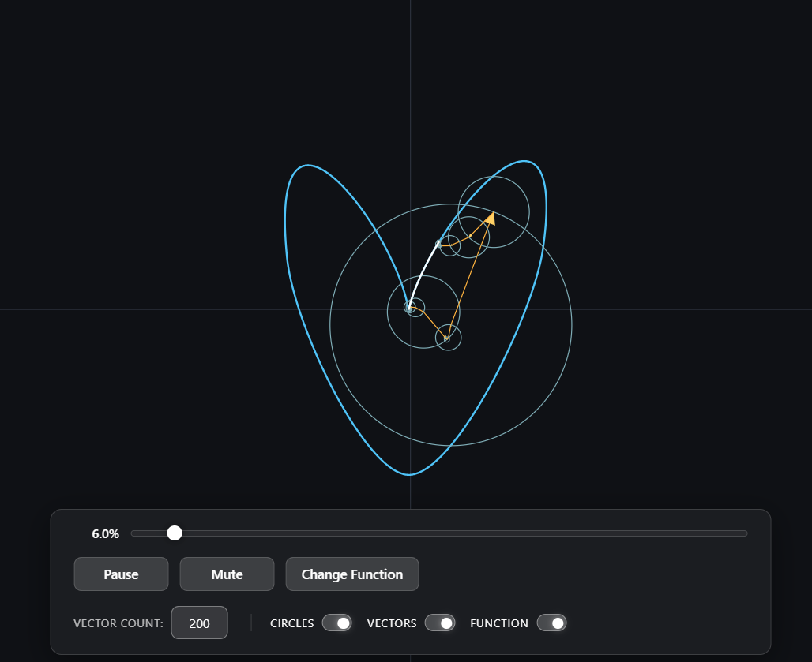
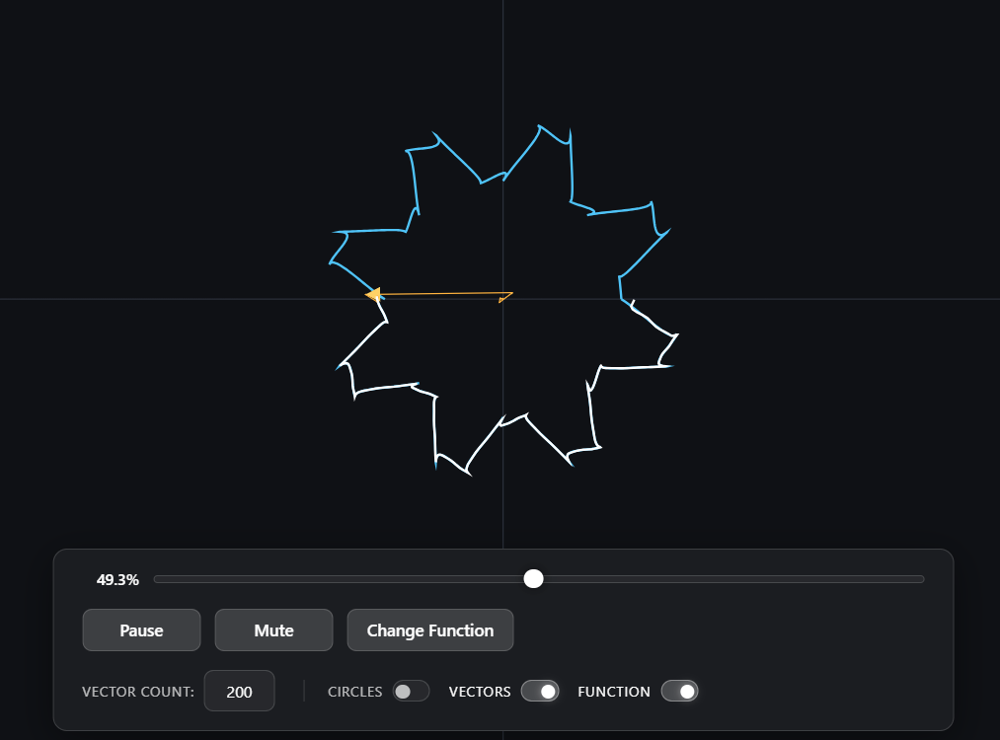
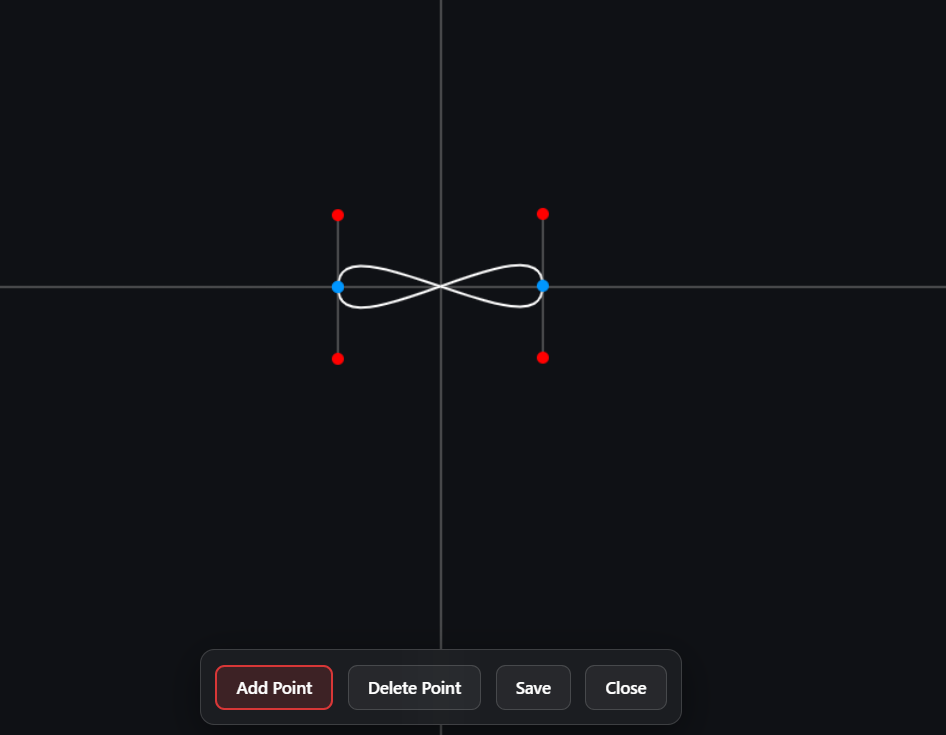

# Fourier & Epicycles

A web-based visualization of Fourier series and epicycles.

### [See it live here](https://sickboydroid.github.io/FourierAndEpicylcles/)

## Sneak Peek

  

 

  
  

## Features

* **Mathematical Rendering:** Real-time visualization of Fourier epicycles tracing out paths.
* **Custom Drawings:** Not a fan of the default shapes? Draw your own custom functions using Bezier curves and watch the math figure out how to trace them.
* **Tweak the Chaos:** Dynamically scale the number of rotating vectors up or down. You can also toggle the visibility of the vectors and circles to see just the final drawing, or turn them all on to watch the underlying machine at work.
* **Time Controls:** Play, pause, or manually scrub through the animation timeline with a progress slider to see exactly how a specific point is being drawn.
* **Custom Audio Engine:** Seamless background music with custom mute/unmute controls, smart buffering, and aggressive compression (using modern `.opus` formatting for instant load times).
* **Zero Jitter:** The audio player gracefully handles browser autoplay policies and download states so the experience never stutters.

